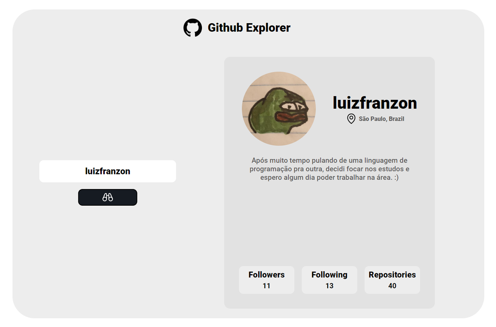

<div id="top"></div>

<h3 align="center">Github Explorer</h3>
  <p align="center">
    Github profiles API fetch tool
</div>

<br>

<!-- ABOUT THE PROJECT -->


<hr>

### Built With

* [Vite](https://vitejs.dev/)
* [ReactJS](https://pt-br.reactjs.org/)
* [Axios](https://www.npmjs.com/package/axios)
* [Phosphor-react](https://phosphoricons.com/)


<!-- GETTING STARTED -->
## Getting Started

**1- Clone this repository:**
```bash
git clone https://github.com/luizfranzon/react-github-explorer.git
```
**2- Install the dependencies:**
```bash
npm install
```
**3- Run the application:**
```bash
npm run dev
```
<hr>

<p align="right"><a href="#top">Click to go back to top</a></p>
